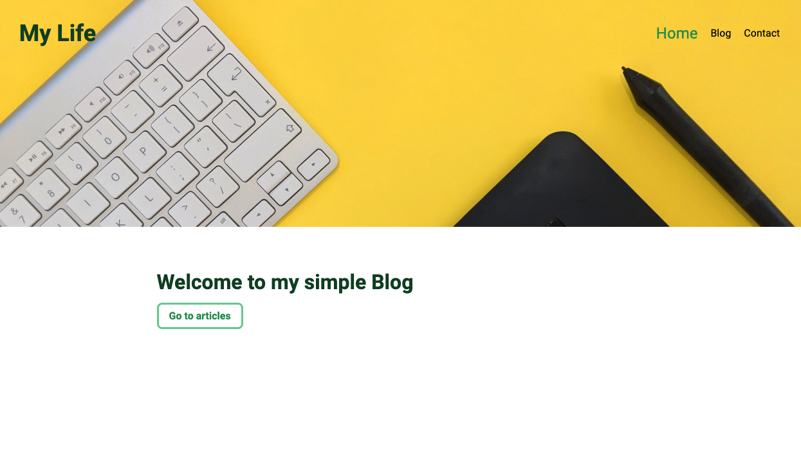
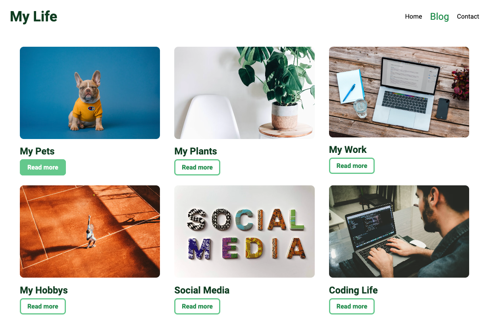
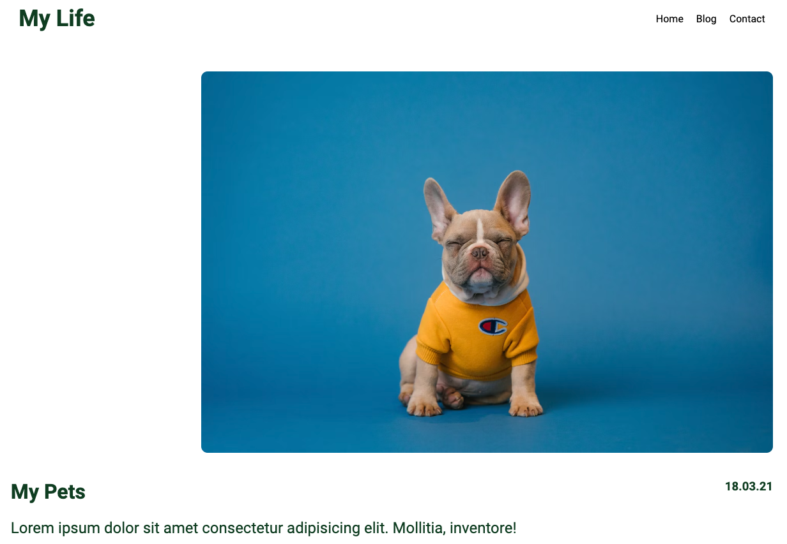

# simple Blog 🐶🪴

- This project was created as part of a Full-Stack Webdeveloper bootcamp from supercode.

- The learning objective of the project:
- internalize the creation of intuitive navigation with react-router-dom
- the first dynamic creation of detail pages using the react npm package: react-router-dom
- dynamic creation of blog previews with maps and props

## Demo Link

https://react-simple-blog-project-cs.netlify.app/

## Screenshots 📸

## Copatible Screensizes

- desktop

## Tech Stack 💻

- react
- HTML
- SCSS
- vite
- GitHub
- netlify
- JavaScript
- GIT
- react-router-dom

## Author 🤵‍♀️

- [@cecilestaller](https://github.com/cecilestaller)
